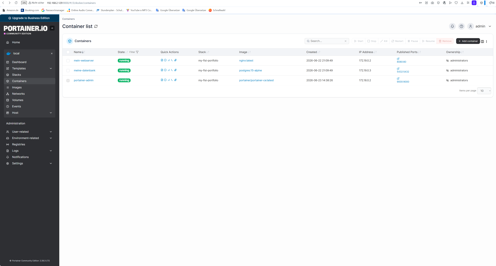

# Mein erstes IT-Infrastruktur Projekt (FiSi Lab)

In diesem Projekt habe ich eine eigene Testumgebung (Homelab) für die Fachrichtung Systemintegration aufgebaut.

## Technische Details:
- **Hypervisor:** Oracle VirtualBox
- **Betriebssystem:** Ubuntu Linux (Server/Desktop)
- **Fernverwaltung:** SSH (Port 22)
- **Containerisierung:** Docker & Docker Compose (Multi-Container Setup)
- **Webserver:** Nginx im Docker-Container (Port-Forwarding 8080:80)
- **Datenbank:** PostgreSQL 15 (Alpine-basiert, Port 5432)
- **Netzwerk:** Isoliertes Docker-Netzwerk (Bridge-Modus) für sichere Container-Kommunikation
- **Automatisierung:** Bash-Skript für regelmäßige Datensicherung (PostgreSQL pg_dump & tar-Komprimierung)
- **GUI-Verwaltung:** Portainer CE (Port 9000) zur grafischen Administration und Log-Analyse

## Was ich gelernt habe:
- Linux-Administration über das Terminal (CLI) und Fehlerbehebung (Troubleshooting)
- Netzwerkinfrastruktur: Bridged Adapter Konfiguration, Port-Mapping und DNS-Anpassungen (daemon.json)
- Docker-Architektur: Container-Isolierung, Docker Volumes und Docker Networking
- Shell-Scripting (Bash) zur proaktiven Automatisierung von IT-Systemprozessen
- Grafische Enterprise-Verwaltung von Container-Infrastrukturen via Portainer

## Screenshots der laufenden Umgebung
### 1. Nginx Webserver via Browser

### 2. Grafische Administration via Portainer

